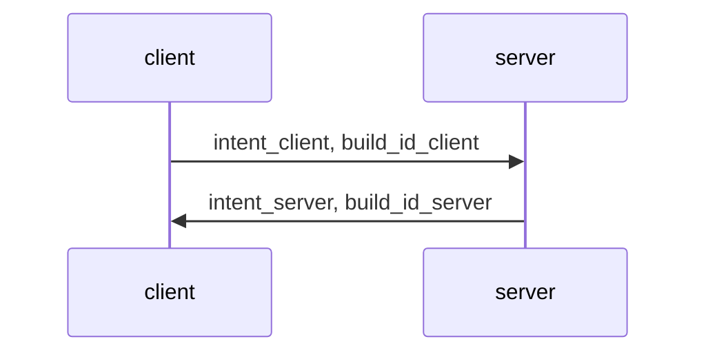
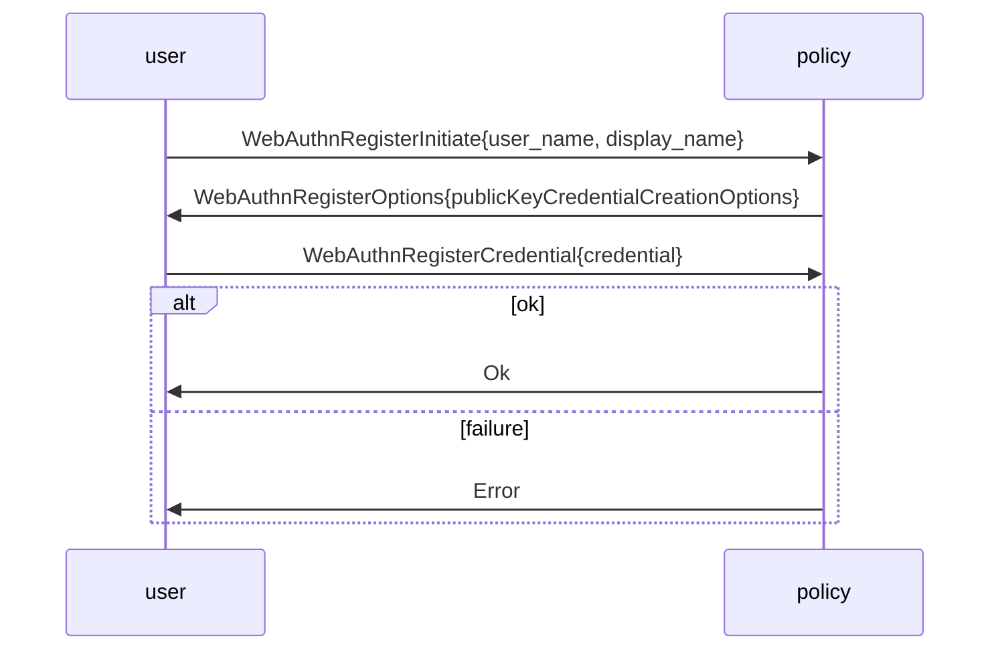
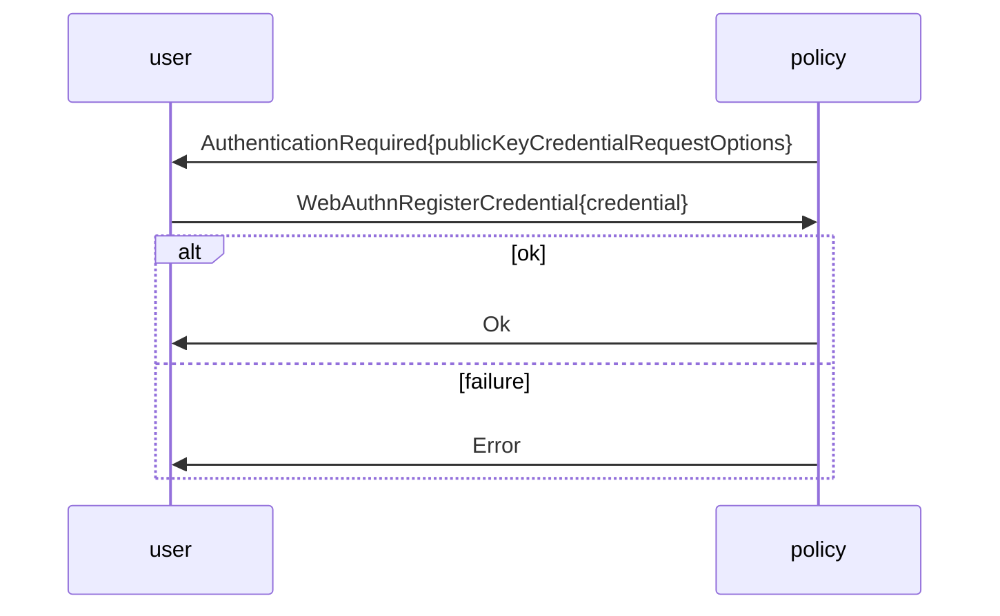
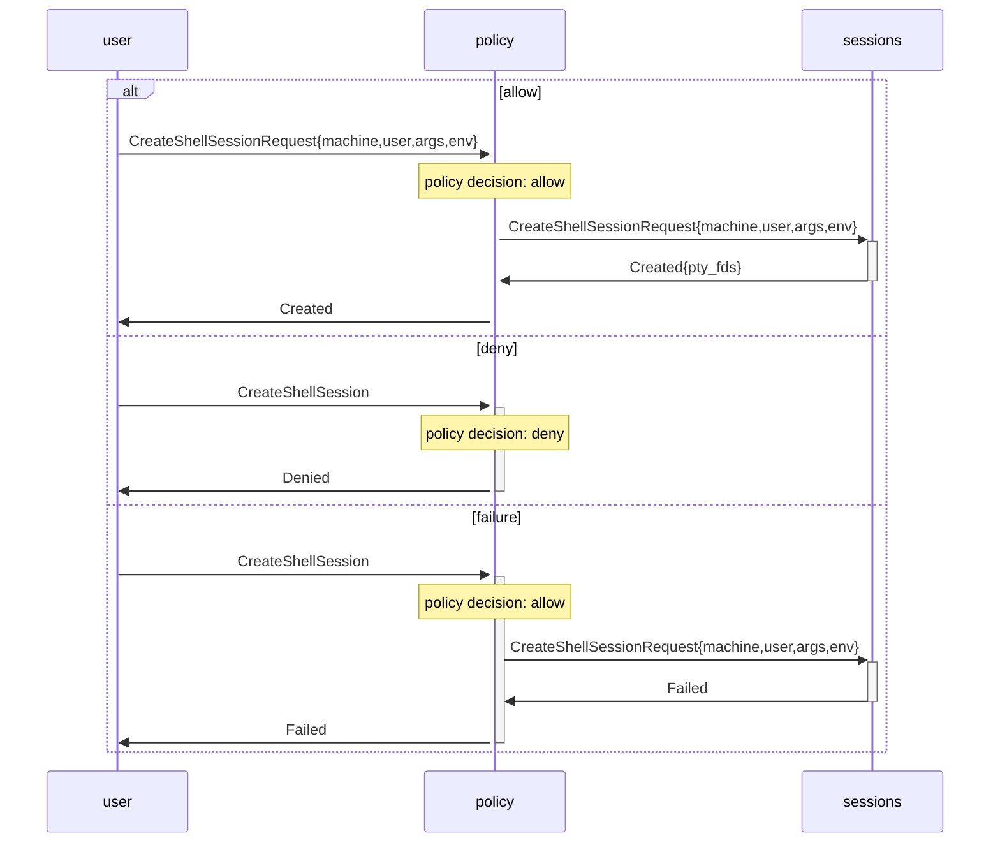

# Protocols used in IPC

TODO Extract diagrams from source code.
Getting payload descriptions right could be tricky.

## Common handshake

We want to avoid attackers being able to confuse a process about its recipient, and having one protocol message be parsed according to a wholly different protocol.

To make this very explicit, all protocol chats begin with a handshake that identifies the protocol being spoken and the executable file hash.

Since this is an IPC protocol where we don't support mismatching versions, to notice any version skew between services, the handshake includes the executable file hash.

Intents use the context string style of [BLAKE3](https://github.com/BLAKE3-team/BLAKE3) `derive_key`, for example `tere 2021-06-03T10:19:27 user to policy client`, and correspondingly `tere 2021-06-03T10:19:27 user to policy server` terminated by a newline.

(TODO if we buy a nice domain, put that in as application instead of just `tere`?)

Build IDs are BLAKE3 hashes of the executable (via `/proc` to ensure it matches what's running), keyed by the corresponding intent.
The peer verifies the hash.
We use keyed hashes so you can't just reply by echoing what the client sent.
We don't use any kind of a challenge mechanism, to allow for precomputing the hash.

## `tere-user@` to `tere-policy@`

TODO this is an incorrect draft and even at that probably outdated, update from [privsep.md](privsep.md)

`tere-user@` worker in state `Active` holds an FD-as-capability that's bound to the currently authenticated user.
On the other end of that FD is a `tere-policy@` worker.

## Big picture

